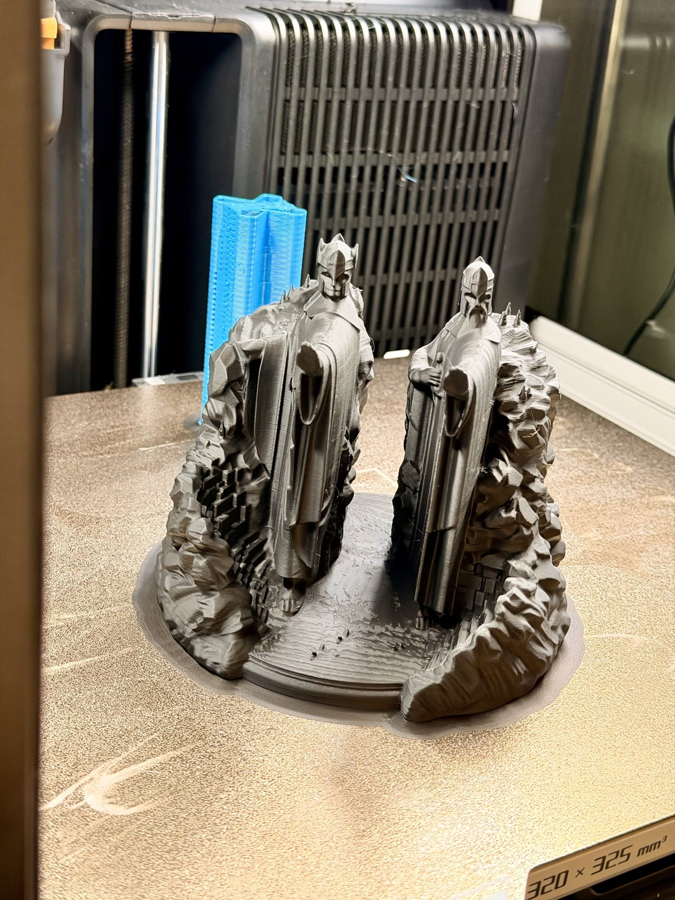
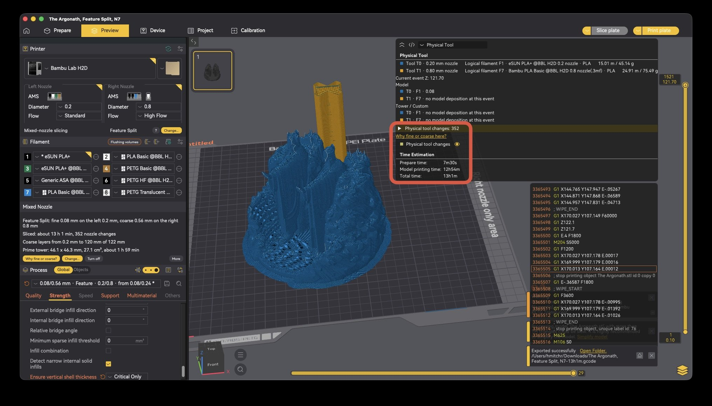
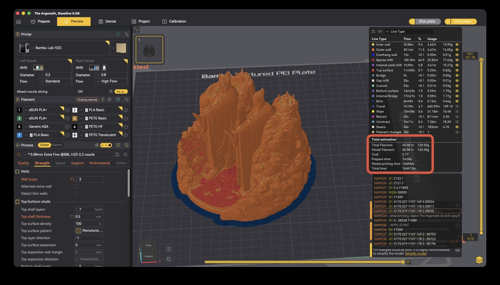

# Cadence Slicer

Cadence Slicer lets a multi-nozzle printer use two different nozzle sizes in one print, with each nozzle at its own layer height. For example, a 0.2 nozzle can print the walls and top surfaces of a part at 0.08 mm layer heights while a 0.8 nozzle prints the infill at 0.56 mm layers. It's a fork of OrcaSlicer.

https://github.com/user-attachments/assets/01cc344a-9887-4e20-97eb-17460ecf469b

## Why I made it

When I bought my H2D at launch, one of the things I was most excited about was eventually being able to print with two different nozzle sizes at once. A small one for detail and a big one for the bulk of the print. I waited for Bambu to add proper mixed-nozzle slicing, and waited some more, and eventually got sick of waiting and did it myself.

## Why it's tricky

Layer height is essentially the vertical resolution of a print. Finer layers make the steps on curved and sloped surfaces smaller, so the outside looks smoother and small details actually come out. The catch is that fine layers take a long time, and if the whole part is printed fine, you spend most of that time on things nobody ever sees, like the infill inside. Bigger nozzles can lay much thicker layers, which is where the large potential time savings are.

Every nozzle size has its own range of layer heights it prints well, roughly 0.04 to 0.14 mm for a 0.2 and 0.16 to 0.56 mm for a 0.8, for example. Those ranges don't overlap, so a 0.2 and a 0.8 in the same print want completely different layer heights. Slicers today, OrcaSlicer included, use one layer height for the whole print, so you have to choose: thin layers that suit the 0.2, where the 0.8 saves you almost no time, or thick layers that suit the 0.8, where the 0.2 can't print its fine detail.

Cadence gets around that by picking a fine layer height for the small nozzle and a whole number N. The big nozzle then prints one layer for every N fine layers, at N times the fine height. For example, with a 0.2/0.8 pair, a fine layer height of 0.08 mm and N = 7, the 0.8 prints at 0.56 mm. The two sets of layers meet at the same height every seven fine layers, which is what keeps them lined up, and the nozzles only swap at those meeting points, not every layer.

Every swap needs a prime. A nozzle that's been sitting idle oozes a bit and cools down, so before it prints again it purges and re-primes on a small prime tower next to the model. That way the next part it prints starts clean, without gaps or blobs. Priming adds time to every print, so I've spent a lot of time and effort trimming it down: it only primes when a nozzle actually changes, the tower settings are set automatically for your nozzle pair, and the tower is sized for the purge each change actually needs.

It also checks that using both nozzle sizes is actually worth it. Even trimmed down, the tower and the nozzle changes cost time, and on small prints that can be more than the big nozzle saves. When that happens Cadence keeps that part of the print, or the whole thing, on the fine nozzle and tells you why. The longer explanation is in [How it works](docs/HOW-IT-WORKS.md).

## Two ways to split a print

Feature Split lets you pick which nozzle prints each feature of a single model. By default the fine nozzle prints the walls, top and bottom surfaces and solid infill, and the coarse nozzle prints the sparse infill. You can move any feature to either nozzle, supports and support interfaces included.

Body Split is for models made of several parts, or models with painted regions where you want to specify which nozzle prints them. Each part or painted selection prints entirely on the nozzle you pick for it, walls and infill both, and the part on the bed can be on either nozzle. Where parts on different nozzles touch, Cadence adds interlocking beams so the joint isn't just two flat faces stuck together.

Supports work in both. The support body and the interface print on whichever nozzles their filaments are on in the Support settings. I usually put the body on the coarse nozzle and the interface on the fine one, and the interface can be a different material, like PETG under a PLA part.

Setup is four steps: pick the split, pick the filaments, pick the layer heights, then check and apply. On the layer height step it slices every coarse layer option in the background and shows the real estimated time for each, next to the one-nozzle time, so you can see what you're saving before you apply.

## Does it actually save time?

This is the Argonath ([MakerWorld model](https://makerworld.com/en/models/2263899-the-argonath-lord-of-the-rings-lotr)) on my H2D, with a 0.2 nozzle on the left and a 0.8 High Flow on the right, in Feature Split at 0.08 / 0.56 mm (N = 7). The slicer estimated 13 h 1 min. The same model at 0.08 mm everywhere, same walls and infill, was 1 d 4 h 12 min. That's about 54% less time, and the visible surfaces are still all 0.08 mm layers from the 0.2.







Mixed nozzle slicing doesn't always win. Small or short prints often don't have enough infill to offset the time cost of the tower, and setup will tell you when one nozzle is faster. Even within the same print there can be areas where infill cross section is too small to make changing nozzles worth it, and the slicer automatically stays on the fine nozzle for infill in these locations. 

## More prints

Minas Tirith, 0.2 + 0.8 High Flow, 0.10 / 0.50 mm (N = 5). Estimated 11 h 57 min instead of 18 h 38 min on one nozzle.

https://github.com/user-attachments/assets/94db87e3-a987-451c-bfd2-0e0f3f247060

Just for fun, here is a test cube printed with 0.2 + 0.8 High Flow, 0.04 / 0.56 mm. This is an N = 14 print, which is the maximum N currently supported on standard Bambu hotends.

https://github.com/user-attachments/assets/3f241395-38ec-4266-b74c-ac1f868f5533

Maine Coon cat, 0.2 + 0.6, 0.12 / 0.36 mm (N = 3). An early test print, about 11 h 46 min. The same file slices to about 6 h 44 min on the current build.

https://github.com/user-attachments/assets/5e48149b-000a-455a-a899-a258c9eb1889

## Printers

| Printer | Status |
|---|---|
| Bambu Lab H2D | Print-tested. Everything was built and tested on my H2D. |
| Bambu Lab H2D Pro | Enabled, not print-tested |
| Bambu Lab H2C | Enabled, not print-tested |
| Bambu Lab X2D | Enabled, not print-tested |
| Prusa XL, Snapmaker J1 and U1, and other IDEX and toolchanger printers in OrcaSlicer's profiles | Enabled, not print-tested. See [SUPPORTED.md](docs/SUPPORTED.md) for the list. |

The engine isn't tied to one printer. It should work on any printer with two or more nozzles, as long as it uses the same kind of prime tower as the Bambu printers. If you have one of the untested printers, I'd really like to hear how it goes.

Nozzles can be any pair of 0.2, 0.4, 0.6 and 0.8 mm, with the smaller one as the fine nozzle, on either side. Each can be Standard or High Flow, and you can use any material your printer prints on a single nozzle. The full list, with the presets for each pair, is in [Supported](docs/SUPPORTED.md).

It won't make a single-nozzle printer any faster, and it uses two nozzles per print, not more. With mixed-nozzle slicing off, it's OrcaSlicer at the base commit named in [NOTICE.md](NOTICE.md), with branding and network changes.

Not affiliated with Bambu Lab, Prusa Research, Snapmaker or the OrcaSlicer project.

## Platforms

- macOS: Apple silicon only, macOS 11.3 or later.
- Windows: x64. The first Windows build isn't out yet and will be added to the release when it is.
- Linux: there's no build. It should build from source with `build_linux.sh`, the same as OrcaSlicer, but I haven't tried it.

## Install

Downloads are on the [Releases page](https://github.com/HMITCHR/CadenceSlicer/releases).

The builds aren't signed, so macOS will warn you the first time you open them. The steps below get you past that. The source for every build is tagged in this repo, so you can build it yourself if you'd rather.

On macOS:

1. Open the DMG. macOS will block it the first time. Go to System Settings, Privacy & Security, scroll down and click Open Anyway, then open the DMG again.
2. Drag CadenceSlicer into Applications.
3. Open the app. macOS will block it once more. Go back to Privacy & Security, click Open Anyway next to the CadenceSlicer message, then open the app again and confirm.

Or, from Terminal:

```
xattr -dr com.apple.quarantine /Applications/CadenceSlicer.app
```

Windows: no build yet. I'm working on the first one and will add it to the release once it's tested.

## First print

1. Fit two different nozzles, for example a 0.2 on one side and a 0.6 or 0.8 on the other.
2. In the Printer panel, set each side's nozzle or sync your printer info. When the two differ, Cadence asks what you want to do. Pick "Set up mixed-nozzle slicing now".
3. Go through the four setup steps: What prints fine, Materials, Detail and speed, Check and apply. The defaults are fine for most prints. On Detail and speed, wait for the times to fill in, or just pick the one marked Fastest.
4. Click Apply and slice.
5. After slicing, "Why fine or coarse?" in the sidebar shows which layer ranges went coarse and why.

Bambu's network plug-in isn't bundled and is off by default. Without it, export the G-code to a USB stick or SD card. To send to a Bambu printer from the app, in LAN-only mode too, turn on "Enable Bambu network plug-in" in Preferences.

## Known issues

Still working on a handful of small issues, mainly:

- Setup's last step doesn't say which nozzle prints the supports yet, so check Support/raft base and Support/raft interface before slicing.
- Tree supports and rafts only work with the support body on the fine nozzle for now. With it on the coarse nozzle Cadence refuses the slice and says why. I'm working on tree supports for the coarse nozzle and they'll come in an update.
- Some settings don't fit the layer grid (adaptive layer height, spiral vase, Arachne walls and a few others). Cadence refuses them with a message that names the setting.

The full list is in the [release notes](docs/RELEASE-NOTES-v1.0.md) and [Supported](docs/SUPPORTED.md#known-issues).

## Other docs

- [How it works](docs/HOW-IT-WORKS.md): the layer grid, nozzle changes, the prime tower, the time check, Feature Split, Body Split and beams
- [Supported](docs/SUPPORTED.md): printers, nozzle pairs, flow types, materials, presets and known issues
- [Privacy](docs/PRIVACY.md): every network call the app can make, and what's off by default
- [Release notes](docs/RELEASE-NOTES-v1.0.md)

## Bugs

Please open an issue with the bug report template. It asks for what I need to track a problem down: the build hash, printer and firmware, the nozzle pair and flow types, the materials, which mode you used, the 3MF, the G-code header, and photos if it's a print problem. The 3MF is the big one. With it I can usually reproduce the slice exactly.

If setup or the sidebar is acting up, the log helps too. On macOS it's in `~/Library/Application Support/CadenceSlicer/log/`.

When Cadence refuses something it tells you why and names the setting. If the reason doesn't make sense, open an issue for that too.

If it saved you some print time, there's a Sponsor button up top.

## What happens next

I'm going to keep working on Cadence and improving the mixed-nozzle slicing for a while. Long term though, I don't plan to maintain this as a separate slicer. The goal is for all of this to end up in OrcaSlicer, so I'm sending it there as a series of pull requests. The first batch is open: seven small fixes to shared code that I found along the way ([#16079](https://github.com/OrcaSlicer/OrcaSlicer/pull/16079), [#16080](https://github.com/OrcaSlicer/OrcaSlicer/pull/16080), [#16081](https://github.com/OrcaSlicer/OrcaSlicer/pull/16081), [#16082](https://github.com/OrcaSlicer/OrcaSlicer/pull/16082), [#16083](https://github.com/OrcaSlicer/OrcaSlicer/pull/16083), [#16084](https://github.com/OrcaSlicer/OrcaSlicer/pull/16084), [#16085](https://github.com/OrcaSlicer/OrcaSlicer/pull/16085)). The mixed-nozzle work itself follows once the maintainers say how they want it split. Until that happens, Cadence is how you can use it.

PRs are welcome here, and even more on the OrcaSlicer PRs once they're up, since that's where this should end up. If you have a Prusa XL, a Snapmaker J1 or U1, or another IDEX or toolchanger printer, a test print and a report is the most useful help right now. On those printers setup switches to the prime tower type the engine knows how to drive. OrcaSlicer's other tower type isn't supported yet, which would be a good thing to help with.

## How it was built

I used AI heavily to build this. Frontier models (Claude and Codex, plus some open source Chinese models) wrote most of the code and did independent reviews. I supervised the models closely, made the design calls and reviewed the critical pieces myself. Every build gets tested hard: a large automated test suite, end-to-end slicing checks against stock OrcaSlicer, an in-app test mode that clicks through the real app, and my own test prints on my H2D. The code has also been through multiple de-slop passes, cleanup passes that cut dead code and trimmed comments and tests, to keep it maintainable and easier to send upstream.

I know how some people feel about AI coding, but without it this would have taken many, many more months to build.

## Licence and credit

Cadence Slicer is licensed under the GNU Affero General Public License v3.0, the same as OrcaSlicer. See [LICENSE.txt](LICENSE.txt), [NOTICE.md](NOTICE.md) and [THIRD-PARTY-LICENSES.md](THIRD-PARTY-LICENSES.md).

It's built on OrcaSlicer and the slicers it came from, and nearly everything in it is their work. Thanks to everyone who made them.

Thanks and enjoy,

- HMITCHR
